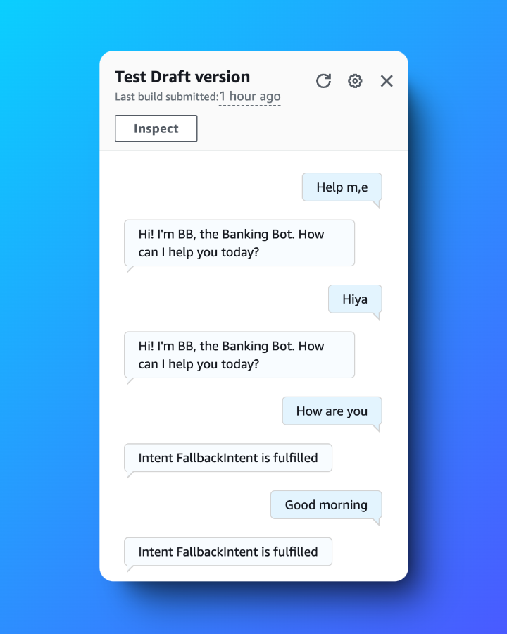
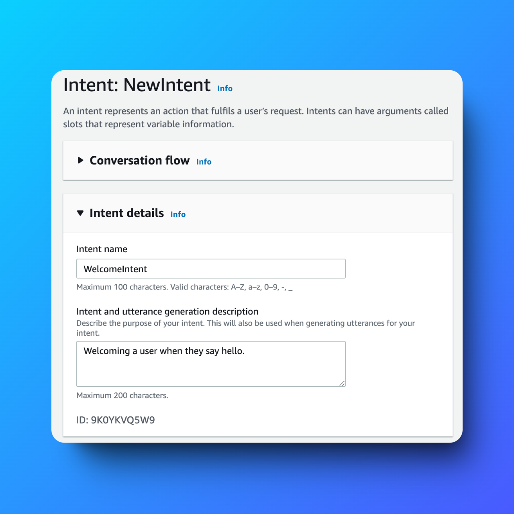
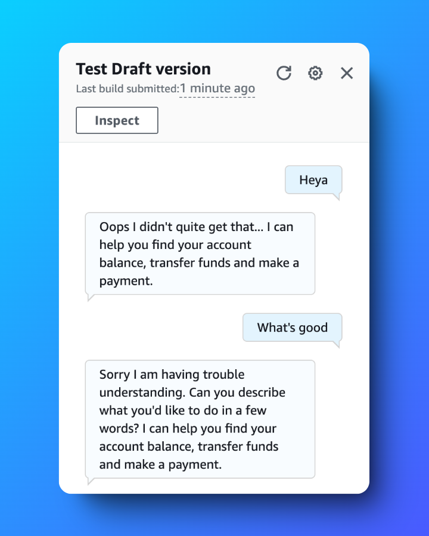
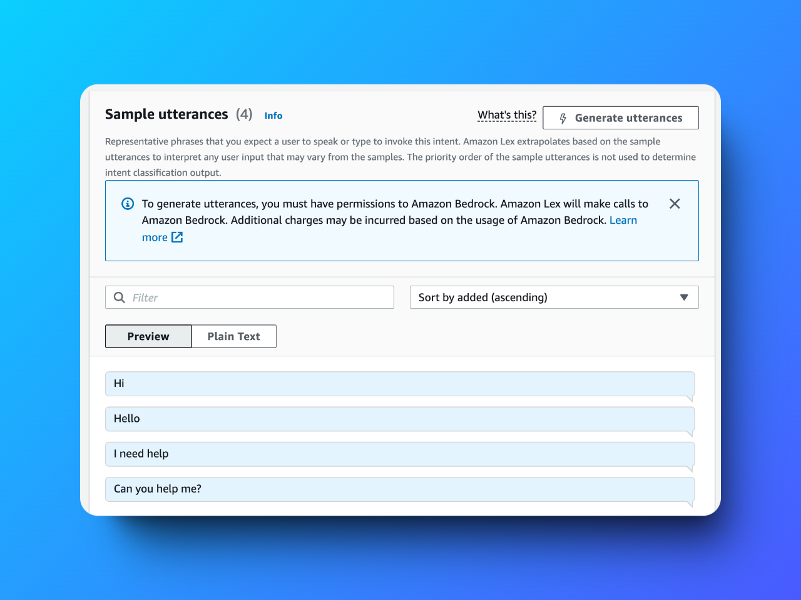

# Build a Conversational Chatbot with Amazon Lex 🤖

---

## 📜 Table of Contents

1. [Project Overview](#project-overview)
2. [Features](#features)
3. [Key Deliverables](#key-deliverables)
4. [Challenges and Lessons Learned](#challenges-and-lessons-learned)
5. [Outcome](#outcome)
6. [Tools and Technologies Used](#tools-and-technologies-used)
7. [Steps to Reproduce](#steps-to-reproduce)
8. [Screenshots](#screenshots)
9. [Acknowledgments](#acknowledgments)
10. [Author](#author)

---

## Project Overview

This project utilizes **Amazon Lex** to create a conversational chatbot with natural language understanding and speech recognition capabilities. Designed for a banking use case, this chatbot processes user inputs seamlessly, providing a smooth conversational experience through its `WelcomeIntent`, `FallbackIntent`, and varied response mechanisms.

---

## Features

- **Natural Language Understanding (NLU)**: Recognizes user intents for accurate responses.
- **Fallback Mechanisms**: Handles unrecognized inputs gracefully with predefined responses.
- **Multi-Utterance Variations**: Supports diverse ways of expressing user intents for flexibility.
- **Secure Integration**: Leverages AWS IAM for secure interactions.

---

## Key Deliverables

1. **Amazon Lex Chatbot**:
   - Built intents such as `WelcomeIntent` for greetings and `FallbackIntent` for unrecognized inputs.

2. **Permission Configuration**:
   - Created a secure IAM role with basic permissions to integrate with Lex and Lambda.

3. **Extensive Testing**:
   - Tested the chatbot with multiple variations of user inputs to ensure reliable performance.

---

## Challenges and Lessons Learned

### Challenges
- Configuring fallback mechanisms to handle unexpected inputs effectively.
- Training the chatbot to recognize variations in user intents for robust responses.

### Lessons Learned
- Adding diverse utterances improves intent recognition accuracy.
- Predefined fallback responses enhance the user experience by guiding users back to the correct path.

---

## Outcome

This project successfully demonstrates the power of Amazon Lex in creating an interactive banking chatbot. With NLU capabilities and robust intent handling, it ensures seamless interactions and aligns with industry best practices for conversational AI.

---

## Tools and Technologies Used

- **Amazon Lex**: For chatbot creation and NLU processing.
- **AWS IAM**: To manage secure permissions and integration.
- **AWS Management Console**: For setup, configuration, and testing.

---

## Steps to Reproduce

1. **Set Up Amazon Lex**:
   - Navigate to Amazon Lex in the AWS Management Console.
   - Create a new chatbot with intents such as `WelcomeIntent` and `FallbackIntent`.

2. **Add Variations and Responses**:
   - Define diverse utterances for each intent to improve accuracy.
   - Configure multiple responses for a dynamic user experience.

3. **Configure Permissions**:
   - Create an IAM role with necessary permissions for Amazon Lex and Lambda integration.

4. **Test the Chatbot**:
   - Use the Amazon Lex testing interface to validate recognition of user inputs.
   - Simulate unrecognized inputs to verify the `FallbackIntent`.

---

## Screenshots

### Intent Configuration  

### Fallback Responses  

### Sample utterances  

---

## Acknowledgments

Special thanks to **NextWork.org** for their mentorship and comprehensive resources, which greatly contributed to the successful completion of this project.

---

## Author

**Hassan Gachoka**  
  
 
